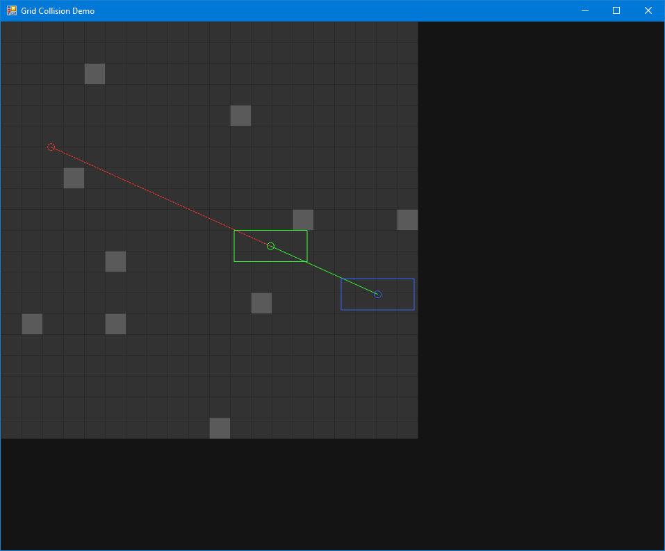

Grid Collision Demo
===================

This project demonstrates how to check for Segment vs. Grid and Swept AABB vs. Grid collision.

Demo Usage
----------

This demo project is a sample Grid implementation and a Windows Forms window for interacting with it.

Click anywhere in the grid space to toggle whether that cell is filled, and click and drag on the start and destination points to move them around. Press the spacebar to switch between segment testing and AABB testing.

The solid green segment shows the travel of the segment / box, and the dashed red segment shows the part of the segment / box sweep that was obscured by a collision.

Algorithm Notes
---------------

The segment test in `Grid.TestSegment(...)` is just the raycasting algorithm described in [A Fast Voxel Traversal Algorithm for Ray Tracing](http://www.cse.yorku.ca/~amana/research/grid.pdf) by Amanatides & Woo, but implemented for only two dimensions.

The swept AABB test in `Grid.SweepBox(...)` repurposes the above concept of stepping to the nearest edge intersection by checking the corner of the box in the direction of travel, but this time checks the row/column about to be entered by the box each step.

This algorithm has a few interesting properties:
 - Checking whether the start position collides can be completely skipped in many cases, e.g. if the box represents a character, you can probably assume that they aren't inside any filled cells at the start of the sweep. This saves lots of time when the sweep is repeated often, such as simulating a character every frame.
 - The number of loop iterations and grid accesses is proportional to the distance that the box travels before colliding. While this seems like it exposes the possibility of running arbitrarily long, it also means that boxes which sweep small distances usually iterate zero times through the loop. We can expect this to be rather common, for example, when simulating objects in small, discrete time-steps.
